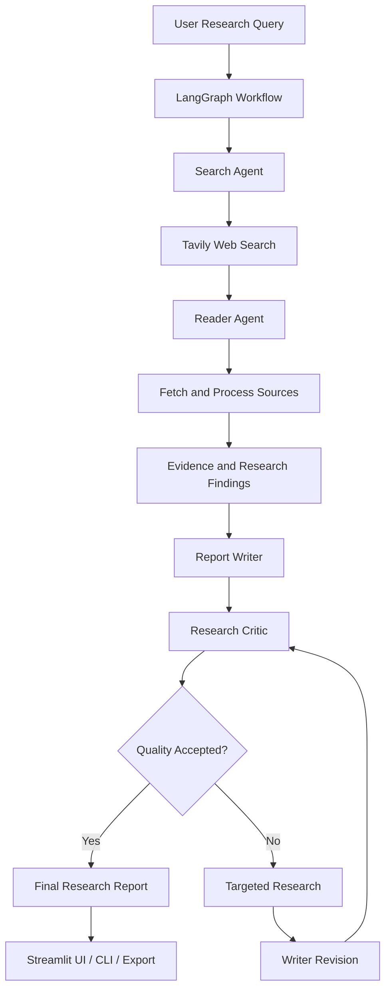

# Multi-Agent AI Research & Report Generation System

A LangGraph-based research application that automates web research, source analysis, report generation, and iterative quality review using specialized AI agents.

The system coordinates a research workflow in which agents search the web, read relevant sources, synthesize evidence, generate a structured report, and evaluate the result before accepting or revising it. It also provides research diagnostics, caching, benchmarking, and automated tests to help inspect and validate the workflow.

## Overview

Researching a topic manually often involves searching across multiple websites, reading lengthy pages, extracting relevant information, organizing findings, and repeatedly reviewing the final report.

This project brings those steps into a coordinated agent workflow using LangGraph. Instead of treating research as a single LLM prompt, it separates the process into specialized stages and uses evaluation feedback to improve the generated report.

### Key capabilities

* **Multi-agent orchestration:** Coordinates specialized agents through a LangGraph workflow.
* **Web research:** Uses Tavily to discover relevant web pages.
* **Source reading:** Fetches and processes relevant web content for research.
* **Evidence-based synthesis:** Organizes retrieved information into claims and supporting evidence.
* **Automated report writing:** Produces structured research reports from collected findings.
* **Critic-driven revision:** Evaluates report quality and can trigger targeted research or another writing pass.
* **Research diagnostics:** Tracks search activity, source processing, evidence, model calls, retries, failures, and quality decisions.
* **Caching:** Supports reuse of cached research results where configured.
* **Multiple interfaces:** Provides a Streamlit interface and command-line entry points.
* **Testing and benchmarking:** Includes automated tests and benchmark assets for evaluating application behavior.

## Architecture

The application follows a graph-orchestrated, multi-agent architecture.



*Conceptual workflow: exact routing and conditional transitions depend on the implementation.*

### Agent responsibilities

| Component         | Responsibility                                                               |
| ----------------- | ---------------------------------------------------------------------------- |
| Search Agent      | Finds candidate sources relevant to the research question.                   |
| Reader Agent      | Reads retrieved pages and extracts relevant information.                     |
| Report Writer     | Synthesizes research findings into a structured report.                      |
| Research Critic   | Evaluates the generated report and determines whether improvement is needed. |
| Targeted Research | Investigates specific gaps identified during evaluation.                     |
| Writer Revision   | Revises the report using additional findings and critic feedback.            |

LangGraph coordinates the workflow and its transitions. The agents are specialized components within the same application, rather than necessarily being separate services or independently deployed processes.

## Research Workflow

### 1. Query and research initialization

The user provides a topic or research question. The workflow initializes the research process and coordinates the relevant graph nodes.

### 2. Web search

The Search Agent uses Tavily to discover candidate web pages. Search diagnostics can capture query counts, result counts, accepted sources, and cache activity.

### 3. Source reading

The Reader Agent processes selected pages and extracts information relevant to the research question. Page-fetch failures and source-processing outcomes can be inspected through the application's diagnostics.

### 4. Evidence organization

Research findings are organized into claims and supporting evidence for downstream synthesis. Evidence acceptance and claim-support metrics help inspect how the workflow uses retrieved material.

These checks indicate whether claims are linked to evidence; they do not independently prove that every claim is factually correct.

### 5. Report generation

The Report Writer combines the research findings into a structured report with sections, analysis, and source references.

### 6. Critic evaluation

The Research Critic reviews the generated report against the application's quality criteria. Its evaluation can inform whether the report is accepted or requires further work.

### 7. Targeted research and revision

When the workflow identifies gaps, it can perform additional research and revise the report. The critic can then evaluate the revised result.

### 8. Final output

The application presents the resulting report and relevant workflow diagnostics through its supported interfaces. Report export is handled by the application's export functionality.

## Technology Stack

| Technology               | Purpose                                                      |
| ------------------------ | ------------------------------------------------------------ |
| Python                   | Application implementation                                   |
| LangGraph                | Workflow orchestration and conditional graph execution       |
| OpenAI API               | Language-model operations, according to the configured model |
| Tavily                   | Web search and source discovery                              |
| Streamlit                | Interactive research interface                               |
| Pytest                   | Automated testing                                            |
| Python compilation tools | Syntax and compilation validation                            |

Additional libraries and utilities are declared in `requirements.txt`. The precise responsibilities of individual dependencies should be verified against the current implementation.

## Project Structure

The repository uses a flat Python module layout. The main application modules remain at the project root because existing imports and tests reference modules such as `graph`, `agents`, and `tools` as top-level modules.

```text
Multi_research_ai_system_langgraph/
│
├── app.py                  # Streamlit application
├── graph.py                # LangGraph workflow orchestration
├── agents.py               # Agent implementations
├── tools.py                # Research and tool integrations
├── benchmark.py            # Benchmark entry point
├── list_model.py           # Standalone model-listing utility
│
├── tests/                  # Automated tests
│   ├── ...                 # Application, graph, agent, and tool tests
│
├── benchmarks/             # Benchmark specifications and datasets
│   └── ...
│
├── reports/                # Local generated reports; ignored by Git
├── .cache/                 # Local cache data; ignored by Git
│
├── .env.example            # Example environment configuration
├── .gitignore              # Files excluded from version control
├── requirements.txt        # Python dependencies
└── README.md               # Project documentation
```

This is a logical overview, not a replacement for the repository's complete file listing. Keep the tree synchronized with the actual files if modules or directories change.

## Prerequisites

Before running the application, install:

* Python compatible with the dependencies in `requirements.txt`.
* Git, for cloning the repository.
* API credentials for the external services enabled in your configuration.
* An internet connection for live web research.

API usage may incur costs depending on provider plans, models, and usage limits.

## Getting Started

### 1. Clone the repository

```bash
git clone <YOUR_REPOSITORY_URL>
cd Multi_research_ai_system_langgraph
```

Replace the placeholder with your repository's actual URL.

### 2. Create a virtual environment

**Windows PowerShell**

```powershell
python -m venv .venv
.\.venv\Scripts\Activate.ps1
```

If PowerShell activation is unavailable, you can invoke the environment's Python executable directly.

**macOS / Linux**

```bash
python3 -m venv .venv
source .venv/bin/activate
```

### 3. Install dependencies

```bash
python -m pip install --upgrade pip
pip install -r requirements.txt
```

### 4. Configure environment variables

Create a local `.env` file using `.env.example` as the reference.

```powershell
Copy-Item .env.example .env
```

Add the required credentials and configuration values supported by the project.

Typical configuration categories include:

* OpenAI API credentials and model selection.
* Tavily API credentials.
* Optional cache and workflow settings, if supported.

**Important:** Use the exact variable names expected by the current source code and `.env.example`. Never commit `.env`, API keys, or other secrets to version control.

### 5. Run the Streamlit application

```bash
python -m streamlit run app.py
```

Open the local URL printed by Streamlit in your browser.

### 6. Run the command-line interface

The repository also includes command-line functionality. Use the CLI entry point and arguments implemented in the project.

To inspect the available command-line options, check the corresponding source file or run its supported help command. Do not assume CLI flags that are not implemented.

## Running Tests

Run the test suite using the project's virtual environment.

**Windows**

```powershell
.\.venv\Scripts\python.exe -m pytest
```

**macOS / Linux**

```bash
python -m pytest
```

To run tests with more detailed output:

```bash
python -m pytest -v
```

The latest reported validation during the repository cleanup was **130 passing tests**. This is a recorded result, not a guarantee that every future checkout or environment will produce the same result.

## Benchmarking

The repository includes `benchmark.py`, a `benchmarks/` directory, benchmark data, and benchmark-related tests.

These components support evaluating selected aspects of the research workflow. Before publishing benchmark results, document the actual benchmark cases, dataset, execution conditions, evaluation criteria, and measured outcomes.

Run the benchmark using the entry point's implemented interface. Check its help text or source code before assuming specific arguments.

### Useful evaluation dimensions

* Search result relevance and source acceptance.
* Source-fetch success and failure rates.
* Evidence coverage and claim-support checks.
* Critic scores and report acceptance.
* Revision frequency and research recovery behavior.
* Model-call counts, retries, failures, and execution time.
* Cache hits, misses, and reuse behavior.

A high evidence-support score should not be interpreted as a guarantee of factual correctness. Independent verification and source quality remain important.

## Observability and Diagnostics

The application exposes workflow diagnostics intended to help understand how a research run behaves.

| Diagnostic                               | What it helps investigate                               |
| ---------------------------------------- | ------------------------------------------------------- |
| Search queries and results               | Whether the search stage discovered relevant material   |
| Accepted sources and domains             | Which sources entered the research process              |
| Page fetches                             | Whether selected web pages could be retrieved           |
| Evidence proposals and accepted evidence | How extracted findings were processed                   |
| Supported claims                         | Whether generated claims have linked evidence           |
| Model calls                              | How many model operations were performed                |
| Retries and failures                     | Where external calls or processing encountered problems |
| Cache hits and misses                    | Whether configured caching was used                     |
| Critic scores and revisions              | Whether quality review led to another iteration         |
| Runtime                                  | How long the workflow took to execute                   |

Interpret these metrics together. For example, a successful page fetch does not establish source credibility, and a critic's approval does not guarantee that a report contains no errors.

## Caching and Performance

The project includes caching-related functionality and diagnostics. Caching can reduce repeated work when equivalent requests or research results can be reused.

Performance should be evaluated using measured data rather than assumed improvements. Useful measurements include cache hit rate, model-call count, page-fetch time, total runtime, and output quality.

Cache persistence, expiration, invalidation, and cache-key behavior should be documented according to the actual implementation.

## Error Handling and Reliability

External research workflows depend on several components, including search services, web pages, network access, and language-model APIs. Failures in any of these components can affect the final report.

When troubleshooting, inspect:

1. Environment configuration and missing credentials.
2. Search results and accepted source counts.
3. Page-fetch failures and content extraction.
4. Model-call errors and retries.
5. Graph routing and conditional transitions.
6. Critic decisions and revision behavior.
7. Export paths and generated report contents.

Use the workflow diagnostics and automated tests to narrow down failures before changing the architecture.

## Is This a RAG Application?

The project is best described as a **multi-agent AI research system with web retrieval and iterative report evaluation**.

It uses retrieved web content to inform generation, but web search and scraping alone do not establish that the application implements a conventional vector-database RAG pipeline.

If the implementation later adds a documented indexing, chunking, embedding, vector retrieval, and grounded-generation pipeline, the project description can be expanded to explicitly include that architecture.

## Security and Responsible Use

* Keep API credentials in local environment configuration.
* Never commit `.env`, tokens, or private credentials.
* Treat web pages as untrusted external content.
* Verify important claims against reliable, preferably primary, sources.
* Review citations and publication dates before relying on generated reports.
* Do not treat AI-generated analysis as a substitute for independent verification.
* Avoid sending confidential research material to external services unless authorized.

## Current Validation Status

The latest reported repository-cleanup checks were:

| Check                                     | Reported result                            |
| ----------------------------------------- | ------------------------------------------ |
| Automated test suite                      | 130 passed                                 |
| Python compilation check                  | Passed                                     |
| `git diff --check`                        | Passed, with existing line-ending warnings |
| Application end-to-end run during cleanup | Not performed                              |
| External API calls during cleanup         | None                                       |

These checks describe the reported cleanup session. They do not establish that every live research workflow, external integration, or export scenario has been validated end-to-end.

## Future Improvements

Potential areas for further development include:

* More systematic evaluation of search relevance and source credibility.
* Better handling of failed or inaccessible web pages.
* Stronger verification of factual claims and citation coverage.
* Improved report formatting and duplicate-content prevention.
* More explicit benchmarks for latency, cost, and output quality.
* Expanded end-to-end tests for the Streamlit UI and graph execution.
* Clearer separation between discovered, fetched, accepted, and cited sources.

These are possible improvements, not claims that the features are already implemented.

## Contributing

1. Create a branch for your change.
2. Keep modifications focused and preserve existing module imports.
3. Add or update tests when changing workflow behavior.
4. Run the test suite and relevant validation checks.
5. Update this README when commands, configuration, or architecture change.


